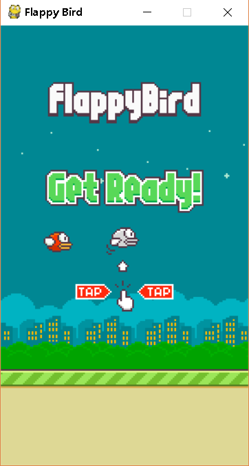

# flappybird-pygame

学习pygame过程中，参照
[这位哥们](https://github.com/sourabhv/FlapPyBird/)
做了一个Flappybird  
添加了gameover游戏信息，计分板  

### 运行：
**1.** 我的版本 python3.7.1, pygame1.9.4  
**2.** 安装pygame(pip3 install pygame)  
**3.** 运行 run_game.pyw

### 截图
